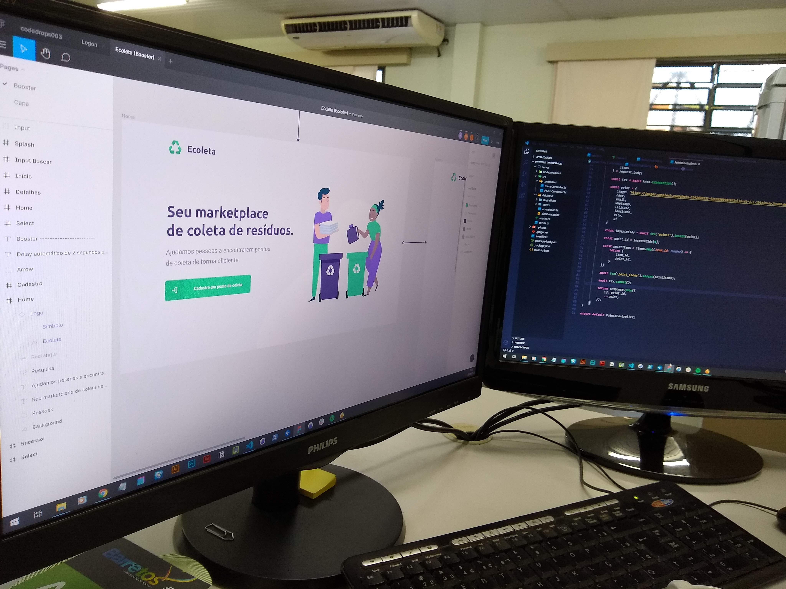

<h1 align="center">
    
</h1>
<h4 align="center"> 
# ecoleta | in development.

💻 an application made with node.js | react | react native ⚛ from the next level week #1 by @rocketseat 🚀
</h4>

<h1 align="center">
  
 
  
</h1>
<h1 align="center">
    
</h1>

## 🚀 Developed with
#### These core technologies ⚛

- [Node.js](https://nodejs.org/en/) 
- [React](https://reactjs.org)
- [React Native](https://facebook.github.io/react-native/)
- [Expo](https://expo.io/)
- [SQLite](https://www.sqlite.org/index.html)
- [TypeScript](https://www.typescriptlang.org/)

## ✔ Made also with:
#### These main dependencies

- **dependencies** 
		cors	"^2.8.5" 
		express	"^4.17.1" 
		knex	"^0.21.1" 
		sqlite3	"^4.2.0" 
- **devDependencies** 
		typescript: "^3.9.3" 
    ts-node: "^8.10.2" 
    
   ---------------------------------------
    
     ######   See you next time [rocketseat](https://www.rocketseat.com.br)
